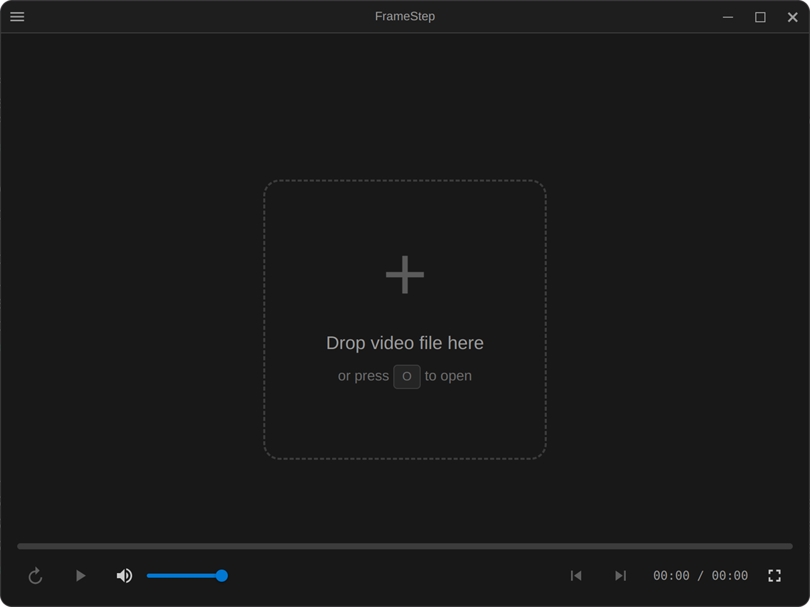

# FrameStep

<p align="center">
  
</p>

<p align="center">
  
</p>

An Electron-based video player with true frame-accurate stepping capabilities. Navigate videos frame-by-frame with precision using FFmpeg for frame extraction.

## Features

- **Frame-accurate navigation** - Step forward/backward by exact frame numbers using FFmpeg
- **Multiple format support** - MP4, MKV, AVI, MOV, WebM, WMV, FLV, M4V
- **Keyboard shortcuts** - Efficient playback control via hotkeys
- **Mouse wheel scrubbing** - Scroll through frames when paused
- **Frame caching** - Preloads frames for smooth stepping
- **Custom titlebar** - Modern frameless window design
- **Drag & drop** - Open videos by dropping files onto the player
- **Timeline seeking** - Click on the progress bar to jump to any position
- **Playback speed control** - 0.25x to 2x in 0.25x steps
- **Frame counter overlay** - Toggle visibility from View menu or shortcut

## Installation

```bash
# Clone the repository
git clone https://github.com/yourusername/frame-step.git
cd frame-step

# Install dependencies
npm install

# Run the application
npm start
```

## Building

```bash
# Build for current platform
npm run build

# Build for specific platforms
npm run build:win    # Windows
npm run build:mac    # macOS
npm run build:linux  # Linux
```

## Keyboard Shortcuts

| Key | Action |
|-----|--------|
| `Space` | Play / Pause |
| `←` | Previous frame |
| `→` | Next frame |
| `Shift + ←` | Jump back 10 frames |
| `Shift + →` | Jump forward 10 frames |
| `O` | Open file |
| `F` | Toggle fullscreen |
| `M` | Toggle mute |
| `<` / `>` | Decrease / increase playback speed |
| `C` | Toggle frame counter |
| `R` | Restart (go to beginning) |
| `?` | Show shortcuts help |
| `Escape` | Close shortcuts help |

## Mouse Controls

- **Scroll wheel** (when paused) - Scrub through frames
- **Click on timeline** - Seek to position
- **Drag & drop** - Open video file

## Tech Stack

- **Electron** - Cross-platform desktop app framework
- **FFmpeg** - Frame extraction and video metadata
- **fluent-ffmpeg** - FFmpeg wrapper for Node.js
- **ffmpeg-static** / **ffprobe-static** - Bundled FFmpeg binaries

## Project Structure

```
src/
├── main/
│   ├── main.js           # Electron main process
│   ├── preload.js        # Preload script for IPC
│   └── ffmpeg-service.js # FFmpeg operations
└── renderer/
    ├── index.html        # Main window HTML
    ├── js/
    │   ├── app.js            # Application entry point
    │   ├── controls.js       # Keyboard/mouse handlers
    │   ├── frame-cache.js    # Frame caching system
    │   ├── ui-overlay.js     # Frame/time display overlay
    │   └── video-controller.js # Video playback logic
    └── styles/
        └── main.css      # Application styles
```

## License

MIT - Free to use, modify, and distribute with attribution.

---

*Made with AI*
